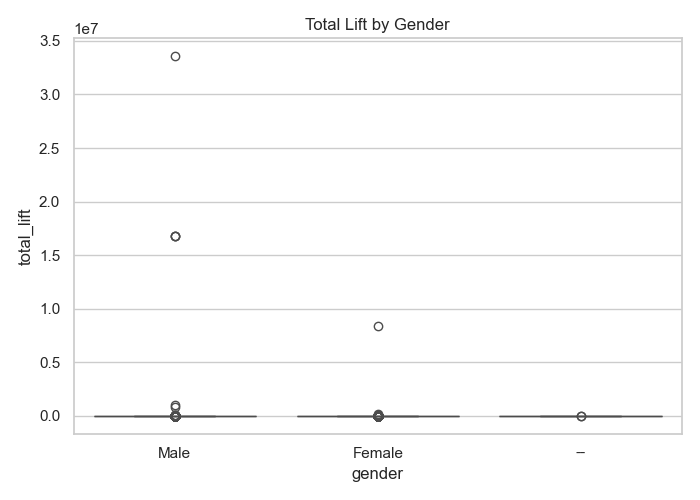
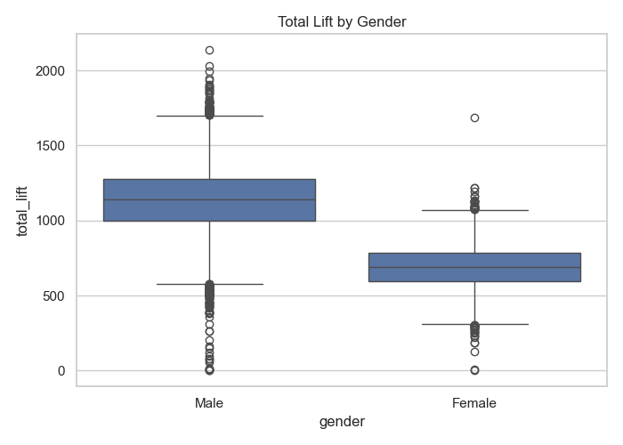
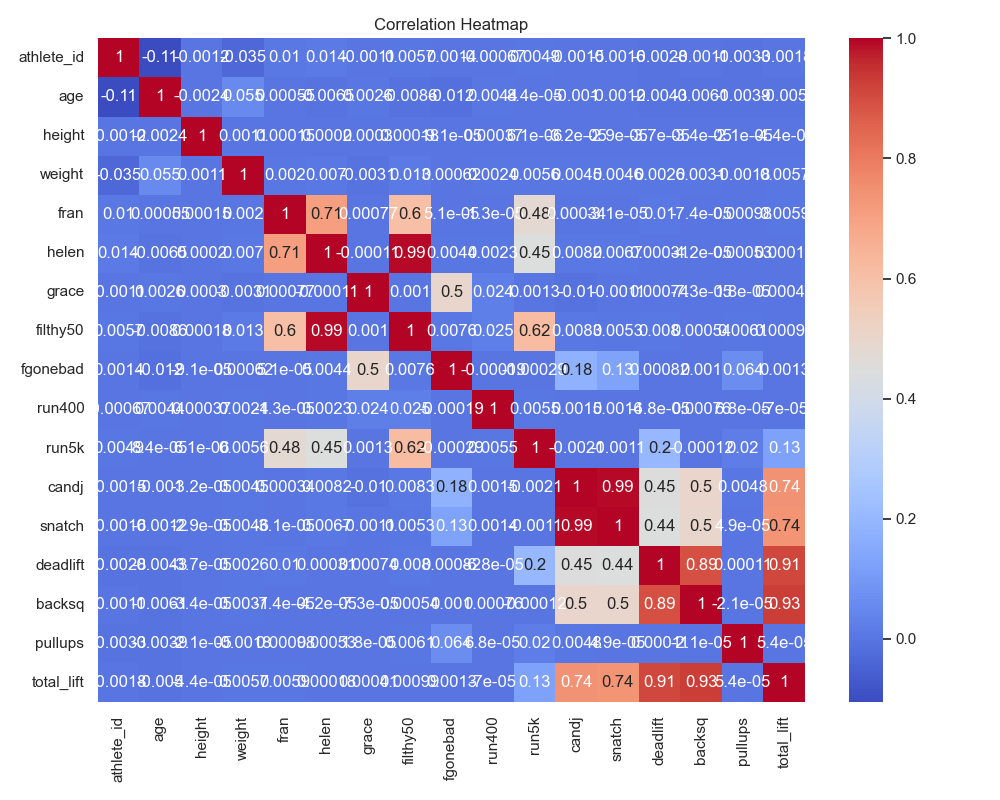
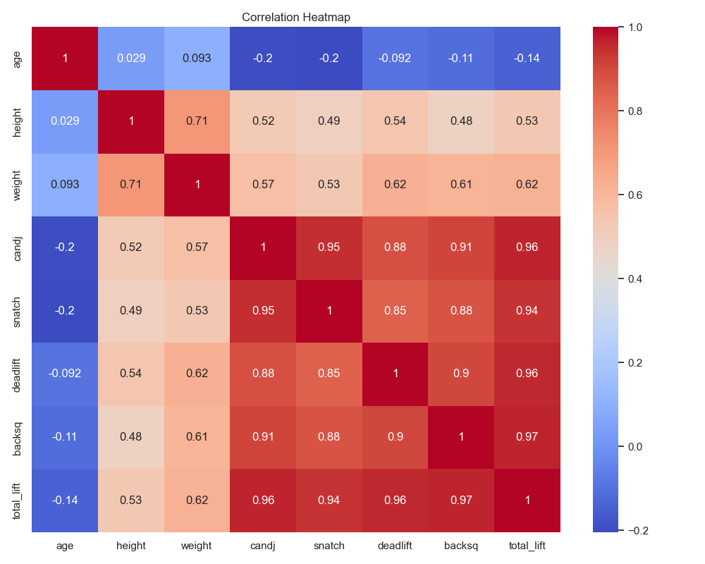
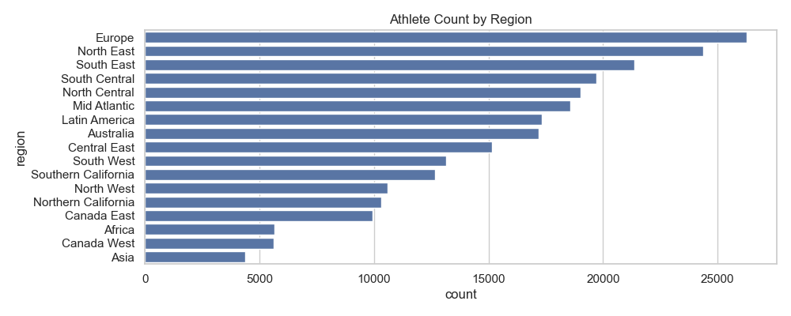
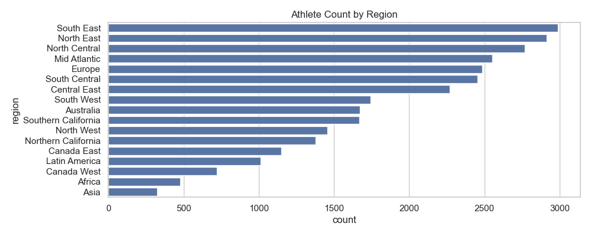
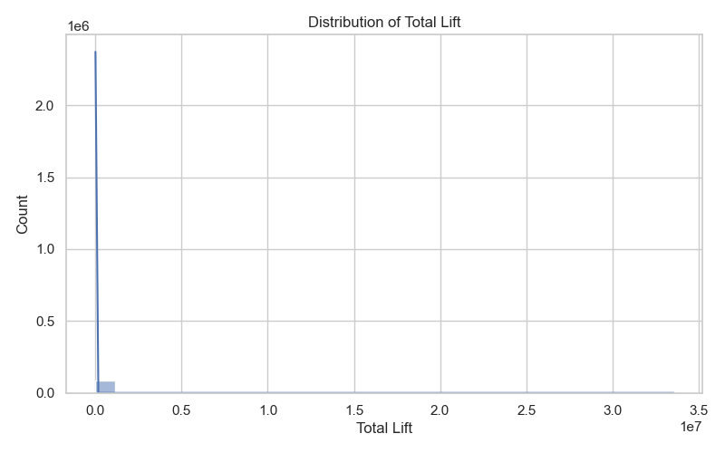
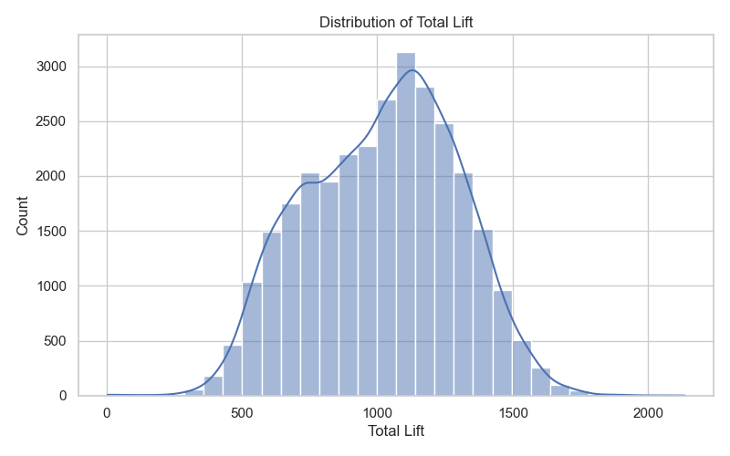
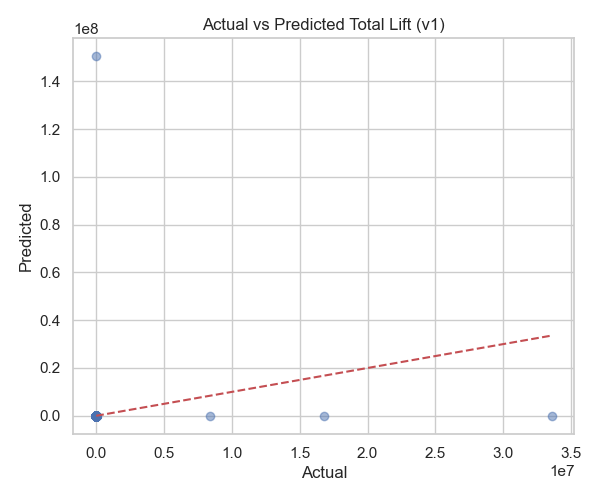
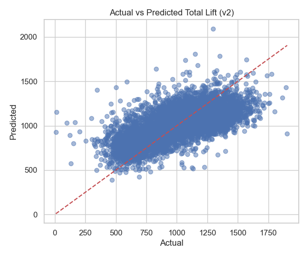

# 🧠 Baseline Model Comparison: v1 vs v2

| Version | MAE | RMSE | R² Score |
|---------|-----|------|----------|
| v1 | 14598.97 | 1270995.38 | -15.31 |
| v2 | 162.95 | 206.46 | 0.45 |

### 📊 Visualizations:

#### Eda Boxplot Gender V1

#### Eda Boxplot Gender V2

#### Eda Corr Heatmap V1

#### Eda Corr Heatmap V2

#### Eda Region Count V1

#### Eda Region Count V2

#### Eda Total Lift Dist V1

#### Eda Total Lift Dist V2

### EDA Comments:
- The v1 dataset contains over 400,000 records but is heavily impacted by missing and extreme values. Key features like age, height, weight, and lift components (candj, snatch, deadlift, backsq) are missing in 20–60% of rows, while performance metrics such as fran, filthy50, and run400 are missing in over 80%. Several numeric fields contain implausible values—e.g., lifts and heights exceeding 8 million—making it unreliable without significant cleaning.

- In contrast, the v2 dataset has been thoroughly cleaned and filtered to include only valid entries across key variables. It contains 30,029 complete records with no missing values and no visible outliers. Summary statistics show realistic ranges for age (18–56), height (52–83 inches), and total lift (4–2135 lbs). The v2 dataset is substantially more trustworthy for modeling and analysis, enabling accurate model training and evaluation without needing imputation or major preprocessing.

#### Pred Vs Actual V1

#### Pred Vs Actual V2

### ML Comments
- The baseline model results highlight a dramatic improvement in data quality and predictive performance between versions. In version 1 (v1), the model performs extremely poorly, with a massive RMSE over 1.2 million and a negative R² score of -15.31 — indicating that the model performs far worse than a simple mean predictor. This is likely due to extreme outliers and data quality issues present in v1. In contrast, version 2 (v2), which was cleaned and filtered for more realistic and complete entries, yields a much more reasonable MAE of 162.95, RMSE of 206.46, and an R² score of 0.45 — showing a moderately strong ability to explain variance in total_lift using just height, weight, and age.