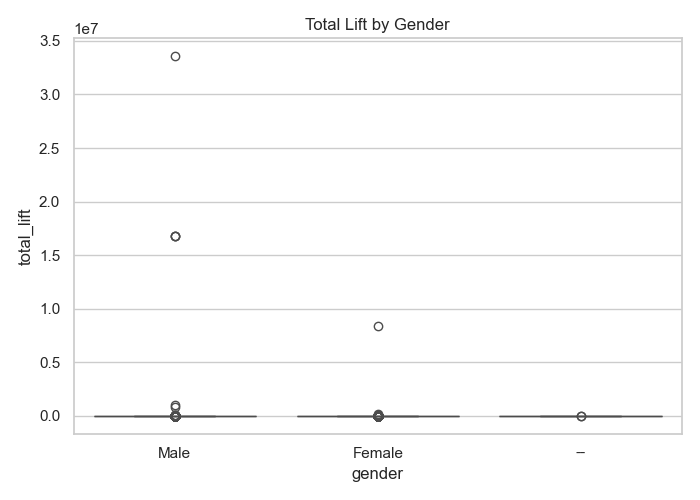
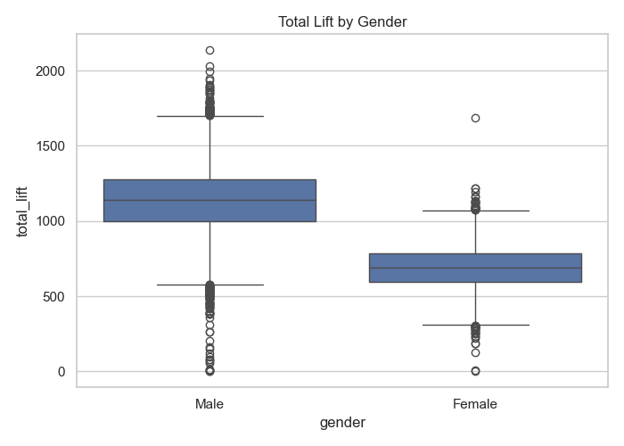
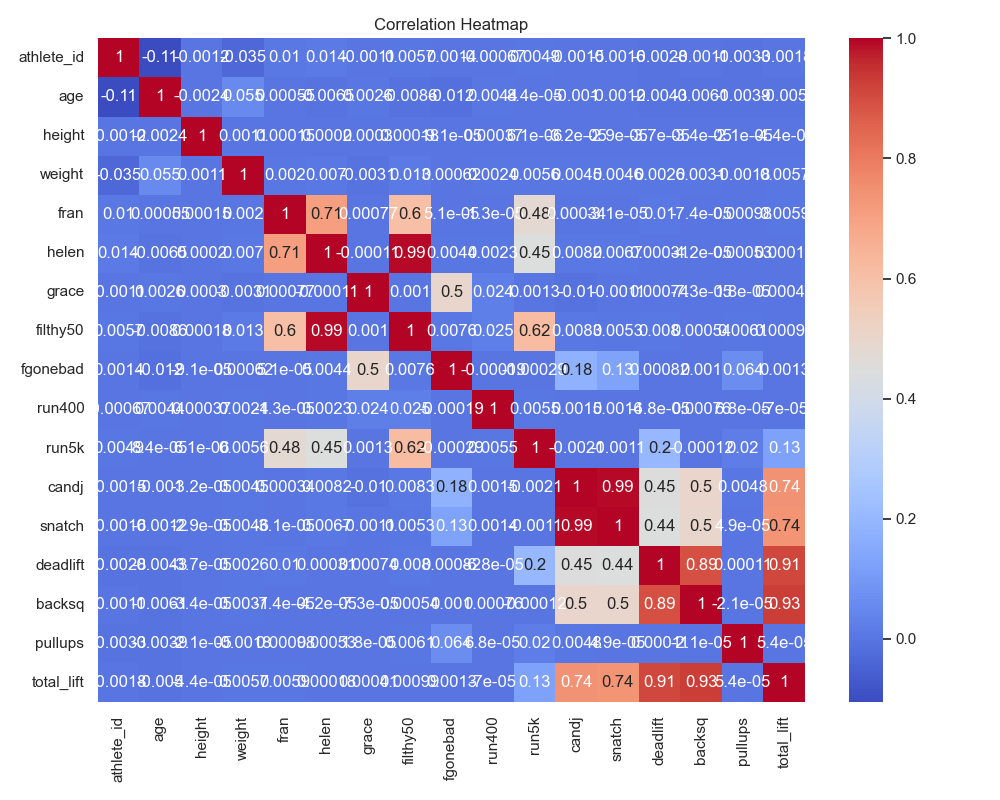
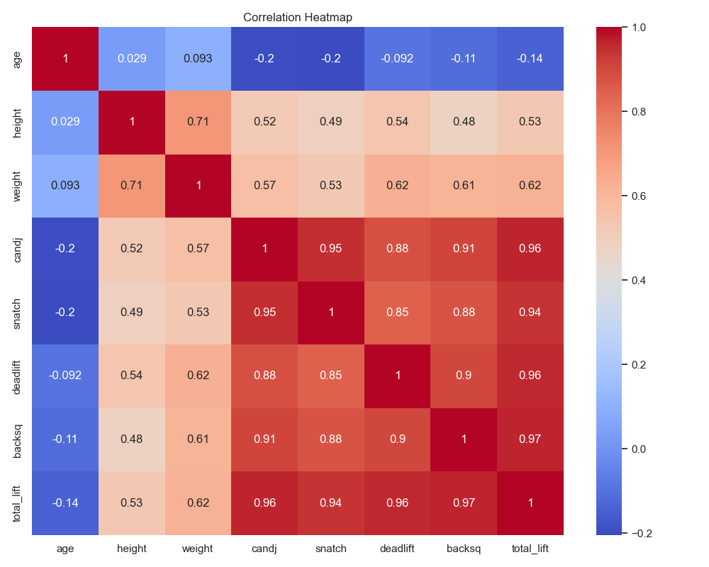
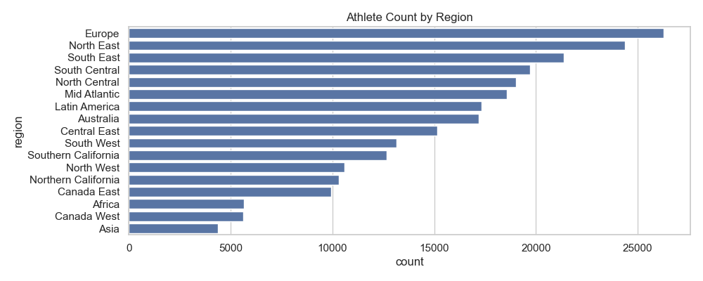
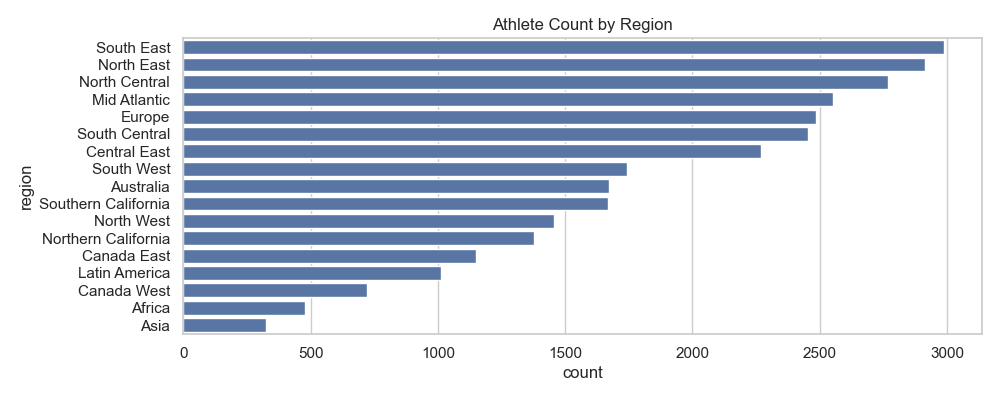
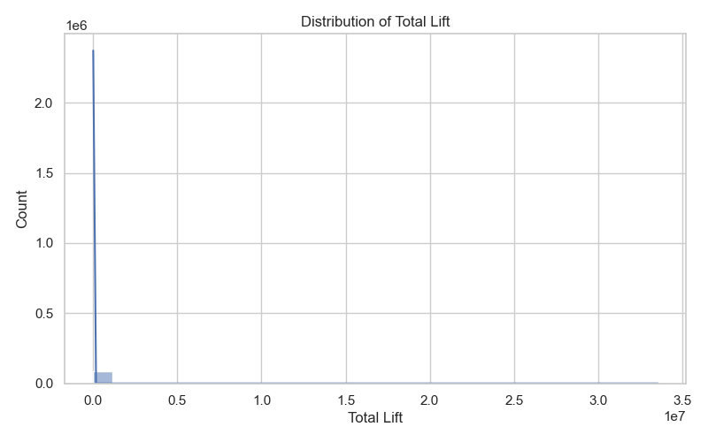
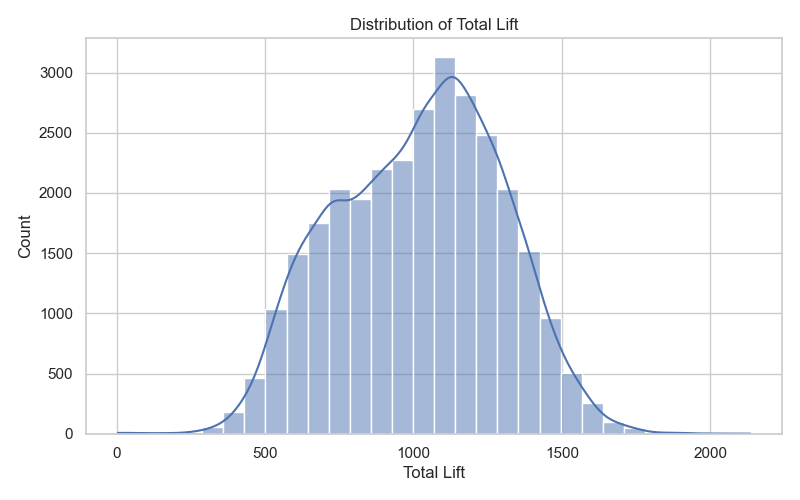
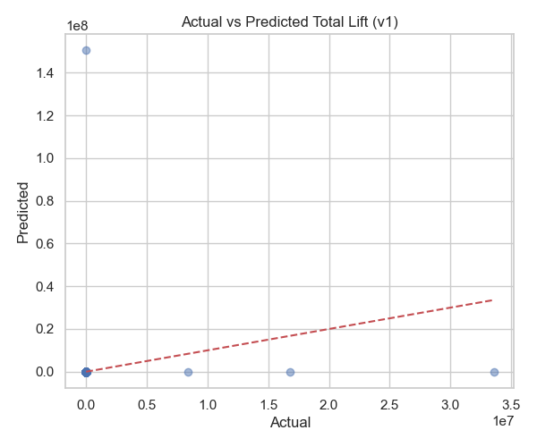
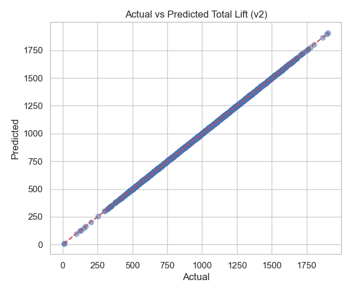

# 🧠 Baseline Model Comparison: v1 vs v2

| Version | MAE | RMSE | R² Score |
|---------|-----|------|----------|
| v1 | 0.0 | 0.0 | 1.0 |
| v2 | 0.0 | 0.0 | 1.0 |

### 📊 Visualizations:

#### Eda Boxplot Gender V1

#### Eda Boxplot Gender V2

#### Eda Corr Heatmap V1

#### Eda Corr Heatmap V2

#### Eda Region Count V1

#### Eda Region Count V2

#### Eda Total Lift Dist V1

#### Eda Total Lift Dist V2

#### Pred Vs Actual V1

#### Pred Vs Actual V2

